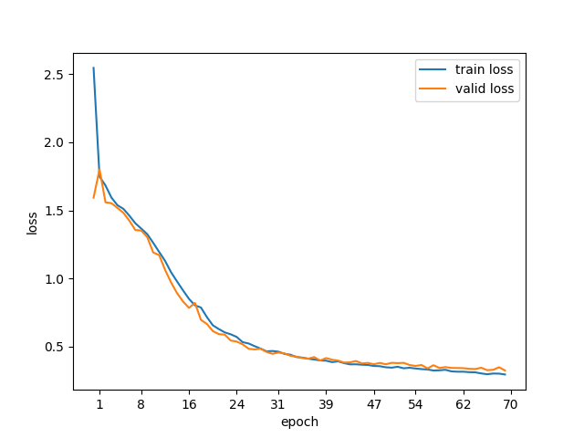
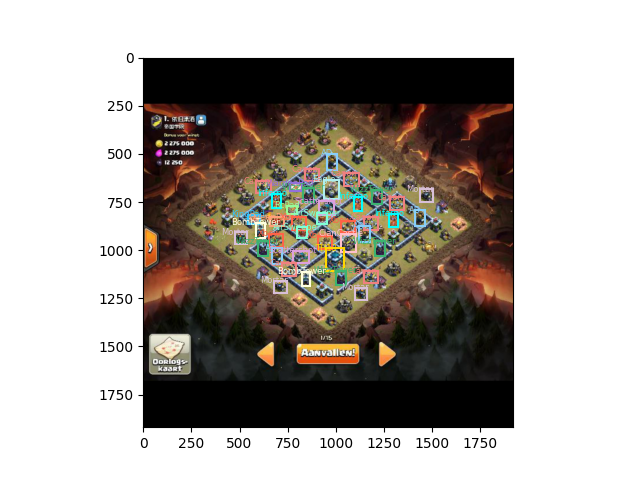

# 🚀 Faster R-CNN 目标检测项目介绍

## 📌 项目概述

🔍 本项目是一个基于 PyTorch 和 Faster R-CNN 的目标检测系统，能够从 COCO 格式的标注数据中训练模型，并在测试集上评估性能。项目包含完整的数据处理、模型训练、验证和测试流程，并提供了可视化工具来展示检测结果。

## 📂 项目结构

```
project/
├── 📚train
├── 📚test
├── 📚valid
├── 📄 coco2csv.py        # 将COCO格式转换为CSV
├── ⚙️ config.py         # 项目配置
├── 🤖 model.py          # 模型定义
├── 🏋️ train.py         # 训练脚本
├── 🧪 test.py           # 测试脚本
└── 🛠️ tools.py          # 辅助工具
```

## 🎯 主要功能

### 1. 📊 数据预处理
- 🔄 **COCO格式转换**：`_annotations.coco.json` → CSV
- 🌈 **数据增强**：水平翻转等
- ⚡ **高效数据加载**：自定义`COCDataset`类

### 2. 🧠 模型架构
- 🏗️ 基于预训练的Faster R-CNN (ResNet-50 backbone)
- ✂️ 可修改分类头适应自定义类别
- 💾 检查点恢复功能

### 3. 🏋️ 训练流程
- 📉 自定义学习率设置
- 📊 训练/验证损失记录
- 💎 最佳模型保存
- 📈 损失曲线可视化

### 4. 🔍 评估与可视化
- 🧪 测试集性能评估
- 🖼️ 随机样本检测可视化
- 🟦 边界框和类别标签显示

## 💡 技术亮点

🔧 **模块化设计**  
⚡ **GPU自动检测**  
🎛️ **集中配置管理**  
👁️ **全面可视化支持**  
🚀 **高效数据管道**

## 🛠️ 使用方法

### 1. 数据准备
```bash
📁 train/
├── 🖼️ image1.jpg
├── 🖼️ image2.jpg
└── 📄 _annotations.coco.json
```
数据来源 [Clash of Clans Computer Vision Project](https://universe.roboflow.com/find-this-base/clash-of-clans-vop4y),如果无法打开可以联系`本人邮箱`   **1668584651@qq.com**

### 2. 训练模型
```bash
🐍 python train.py
```

### 3. 测试模型
```bash
🐍 python test.py
```

### 4. 数据格式转换
```bash
🐍 python coco2csv.py
```

### 5.结果展示
1. 损失函数展示，可以简单的看出，损失函数已经收敛
   
   

2. 真实标注
   
   

3. 预测标注
   
   
   
4. 从图中可以明显的看出预测和真实还是有较大的出入，模型和数据还需要一些改进。

## 📦 环境要求

| 包名 | 版本 |
|------|------|
| Python | 3.8+ |
| PyTorch | 2.4.1+ |
| torchvision | - |
| albumentations | - |
| pandas | - |

## 🚀 未来扩展

- [ ] 更多数据增强技术
- [ ] 支持YOLO/SSD等模型
- [x] 额外添加[简单调用YOLO模型进行对比](https://github.com/xixihaianxian/Yolo-Clash-of-Clans)